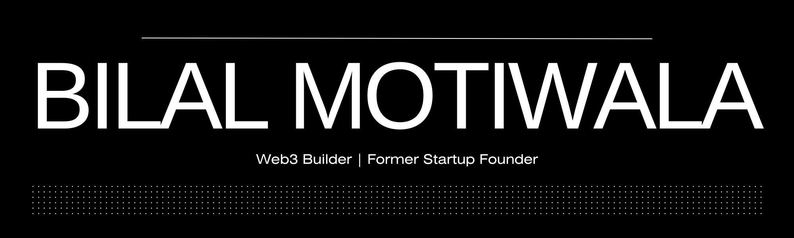

</img>
<h2>About Me</h2>
Former startup founder, full stack and blockchain developer with over 4+ years of experience in technical product development, team management and working in startups.
  

Planned, developed and managed multi-faceted products including custom CRMs and web3 marketplaces. Each product comprised of varying degree of automation and scalable to accommodate users at large.
 

<h2>Get In Touch</h2>
Feel free to send me an email at [muhammedb.vi1@gmail.com] or send a message on Telegram [@bilalmotiwala]. Also, I'm currently on the look out for new opportunities.
 

<h2>Experience</h2>
<b>Founder and CTO, PymeDAO:</b> A web3 marketing platform allowing companies to target and rewards users for using their product.
  
<b>Head of Tech and Logistics, Glowb:</b> An e-commerce brand focused on skincare products founded in the UK.
  
<b>Web Developer, Visionary Institute:</b> A digital agency based out of Tbilisi, Georgia.

<h2>Achievements</h2>
<b>500 Global Backed Founder:</b> Raised pre-seed investment from 500 Global as founder of PymeDAO.
  
<b>Google for Startups Alum:</b> Received benefits from Google for Startups as founder of PymeDAO.
  
<b>GITA Grant Winner:</b> Received a non-equity grant from Georgia's Innovation and Technology Agency as founder of PymeDAO.
  
<b>Buildspace Sharktank and Demo Day Winner:</b> Received grant prizes from Buildspace as founder of PymeDAO.

<h2>Languages, Tools and Skills</h2>
<b>Languages/Tools:</b> Javascript, Typescript, HTML5, CSS3, NodeJS, Express, React, NextJS, Solidity, Hardhat, Foundry, Python, NoSQL, Firebase, NextUI, TailwindCSS, IPFS, Git, VS Code
  
<b>Google Cloud:</b> Cloud Functions, AppEngine, Cloud Shell, Node Management, Pub/Sub
  
<b>Soft Skills:</b> Team Management, Client Management, Resource Planning, Project Planning, Partnerships and Pitching.
